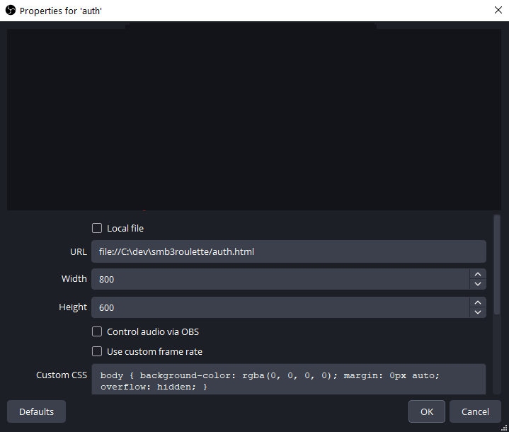
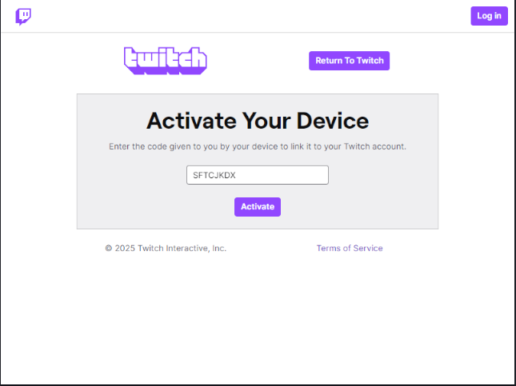
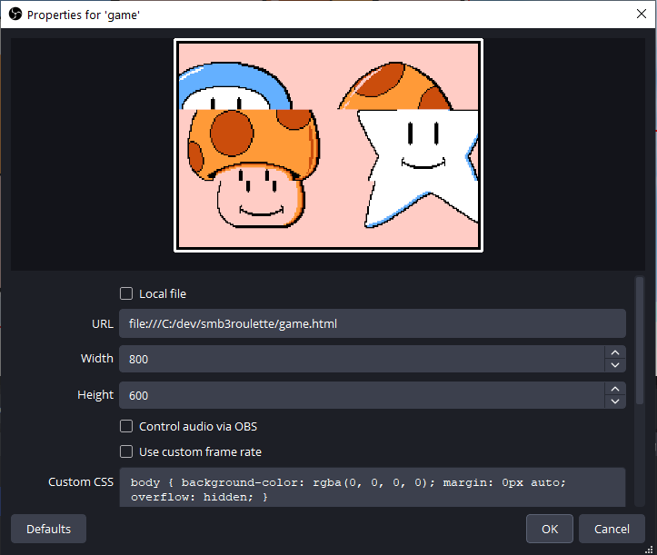

# SMB3 Roulette

This is an implementation of the roulette mini game from Super Mario Brothers 3, which is playable with Twitch redeems.

It is intended to be easily customizable with replacement images and sounds.

# Playing on your own computer

```
git clone https://github.com/toastplusplus/smb3roulette.git
```

Open game.html, and press space or click to stop one of the roulette wheels.

It will make you click or press space to play, as most browsers won't let web pages play sounds without interacting (OBS does not require this).

# Use with OBS and Twitch

Make sure you can play the game normally outside of OBS first.

You'll need to create a redeem in Twitch to stop a roulette wheel. Note down the name you gave to the redeem.

Next, open config.js. It will look something like this:

```
// Game configuration
const twitchEnabled = false; // UPDATE ME
const twitchRewardTitle = ''; // UPDATE ME
const twitchUserName = ''; // UPDATE ME
const musicEnabled = false;
const soundEnabled = true;
const twitchAppClientId = 'nuzm3folc6kvdmgvgye31eiq6ufd1e';
```

Update the marked fields (with your own values):

```
const twitchEnabled = true;
const twitchRewardTitle = 'Stop the roulette';
const twitchUserName = 'ironmouse';
const musicEnabled = false;
const soundEnabled = true;
const twitchAppClientId = 'nuzm3folc6kvdmgvgye31eiq6ufd1e';
```

Next, you'll want to create two browser sources in OBS. One will be to authorize the app before you go live, and the other will be the actual game.

You'll need to set the URL to a file URL pointing to the auth.html file:



Interact with this browser source and run through the Twitch authorization flow. It should only ask for permission to listen to redeems. Do check the box to remember the machine for 30 days, unless you want to do this every time.



Once you have the authorization browser source set up, you'll need to also add one for the game. That should use the game.html file:



The game browser source will _not_ function with Twitch until you've authorized it.

Once you have everything set up, test things out:
- Open up OBS (don't go online)
- Load the game browser source
- Trigger your new redeem on Twitch, or in the OBS chat dock

If everything goes well, you should see the roulette stop from the redeem.

If nothing happens, make sure you've entered the configuration correctly, and check for an error at the top of the game screen.

# Customization

The easiest form of customization is to replace the images or sounds. Just replace files in the img/ or audio/ directories.

The replacement images will need to be in the same aspect ratio. Make sure you use transparency, or match the background of the roulette.

If you have some basic understanding of HTML and Javascript, you can also change the behavior of the roulette. At the top of game.js is an array with the roulette game's configuration.

# Note on Twitch auth

This was written in an intentionally primitive style, so that it requires no build, and no running application.

The downside of that is that the only compatible Twitch authorization flow is device authorization. It can't store secrets safely, or receive a callback over HTTP.

# Limitations

The authorization flow does not appear to work in Firefox, as the localStorage does not appear to function across files.
